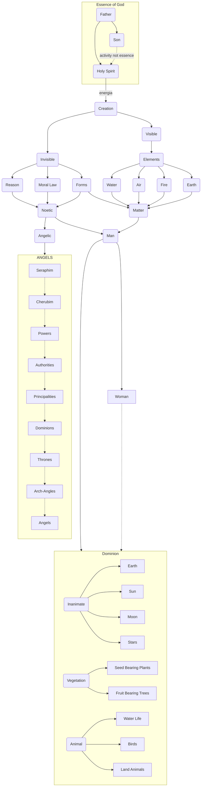

# Classical Hierarchy of Things

Date Published: February 11, 2022
Featured: No
Status: Publish

```mermaid
flowchart TB
subgraph E [Essence of God]
	direction TB
	F(Father) --> S(Son) 
	F --> HS(Holy Spirit)
end
S -.-> |activity not essence | HS
--> |energia| C(Creation)

%% INVISIBLE
C --> I(Invisible)
I --> R(Reason)
I --> MO(Moral Law)
I --> FS(Forms)
R & MO & FS --> N(Noetic)

%% ANGELIC
N --> A(Angelic)
A --> ANGELS
subgraph ANGELS
	direction TB
	SERA[Seraphim] -.-> Cherubim
	-.-> Powers
	-.-> Authorities
	-.-> Principalities
	-.-> Dominions
	-.-> Thrones
	-.-> Arch-Angles
	-.-> Angels
end

%% VISIBLE
C --> V(Visible)
V --> EL(Elements)
EL --> WATER(Water)
EL --> AIR(Air)
EL --> FIRE(Fire)
EL --> EARTH(Earth)
FS & WATER & AIR & FIRE & EARTH --> MA(Matter)

%% ANIMAL
N & MA --> MAN(Man)
MAN --> Woman

%% MAN
MAN --> Dominion
Woman -.-> Dominion

subgraph Dominion
	direction LR
	IA(Inanimate) --> Earth 
	IA --> Sun 
	IA --> Moon 
	IA --> Stars

	VEG(Vegetation) --> SEED[Seed Bearing Plants]
	VEG --> FBT[Fruit Bearing Trees]

	ANI(Animal) --> WL[Water Life]
	ANI --> Birds
	ANI --> LA[Land Animals]
end

```